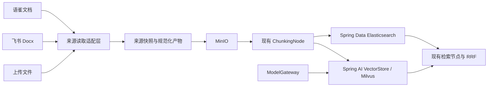
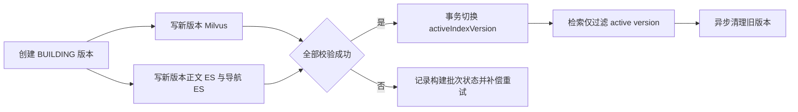

# 统一文档来源与 Spring AI 集成设计

## 1. 背景与目标

项目已经具备“上传文件 → 解析 → 切分 → Milvus + Elasticsearch 索引”的主链路，但部分基础能力由项目自行实现。Spring AI / Spring AI Alibaba 已提供 VectorStore、EmbeddingModel、DocumentParser、DocumentReader 及 Spring Data Elasticsearch 等可复用能力。

本设计的目标是在不破坏现有领域任务、动态模型治理和检索策略的前提下，复用框架标准能力，并将上传、飞书和语雀统一为可扩展的文档来源。

本设计不包含：飞书 Wiki/旧版文档、平台全量遍历、OAuth、自动同步、Webhook、附件 OCR、同 URL 原地更新，以及前端交互设计。

## 2. 已落地能力与待解决缺口

| 领域 | 决策 |
| --- | --- |
| 模型调用（已落地） | 业务模块只依赖 `ModelGateway`；供应商适配、熔断、降级、监控和审计留在网关内部。 |
| Embedding（已落地） | `ModelGatewayEmbeddingModel` 已适配 Spring AI `EmbeddingModel`，仅供 VectorStore 内部使用。 |
| 向量索引（已落地） | Spring AI `VectorStore` 已操作 Milvus；项目 `chunkId` 与 Spring AI `Document.id` 对齐。 |
| 关键词索引（已落地） | Spring Data Elasticsearch 已替换手写 HTTP 客户端；RRF 仍由现有检索节点执行。 |
| 双索引替换（已实现，短期） | Milvus 与正文 ES 均按文档先删除旧记录再写入新 chunk；章节导航仅在关键词索引启用时写入。 |
| 索引构建一致性（延后） | 当前系统整体视为唯一默认知识库；索引版本、构建批次和切流在迁移多知识库时再实现。 |
| Embedding 变更策略（已确认） | 已有知识库禁止切换 Embedding 模型；若未来开放，必须整库新版本重建并切流。 |
| 索引配置真实性（延后） | 当前保持全局唯一模型与 collection；不暴露未生效的文档级选择，迁移多知识库时再按索引配置解析运行时 VectorStore。 |
| 解析产物（已实现） | `ParsedArtifact` 是整份文档的规范化解析产物，仅传递对象键、内容类型和元数据。 |
| 文件解析（已实现） | 在项目解析器适配层接入 Spring AI Alibaba `DocumentParser`，不让框架直接写向量库。 |
| 外部来源 | 上传、飞书、语雀是并列 Source；MinIO 是统一的制品存储与可重试检查点。 |
| 飞书 | 自建防腐 Reader，读取 Docx Block 树与 revision 后生成快照和 Markdown。 |
| 语雀 | 包装 Spring AI Alibaba `YuQueDocumentReader`，接入项目统一来源契约。 |

## 3. 总体架构



来源读取适配层只负责读取、规范化和可追溯信息；后续仍由现有 Outbox、解析任务、ChunkingNode、IndexingNode 和失败重试驱动。禁止使用框架示例中的 `Reader → Splitter → VectorStore` 直通流程。

## 4. 领域模型与术语

| 名称 | 含义 | 所有者 | 非含义 |
| --- | --- | --- | --- |
| Source | 业务内容最初到达系统的位置，如上传、飞书、语雀。 | document 模块 | MinIO 中的文件。 |
| Source Reader | 按来源协议读取内容并产出统一读取结果的适配器。 | infra 模块 | 切分器或索引器。 |
| 来源快照 | 对外部 API 响应、Block 树或下载文件的不可变保存副本。 | 对象存储 + document 元数据 | 最终 Chunk。 |
| 解析产物 | 已规整为 Markdown、纯文本等可供切分器消费的内容。 | parser / object storage | 远端来源本身。 |
| 索引版本（`indexVersion`） | 一个知识库/索引配置在某一模型、切分与检索 schema 下的完整可查询版本。 | retrieval + knowledge base 配置 | 单篇文档的处理尝试。 |
| Embedding 绑定 | 知识库创建时确定的模型路由、模型标识、向量维度与 Milvus collection 组合。 | knowledge base / index configuration | ModelGateway 的全局默认模型。 |
| 索引构建批次（build batch） | 指定文档在指定 `indexVersion` 下的一次可重试构建尝试，记录双索引阶段状态。 | retrieval workflow | 可供查询切流的全局索引版本。 |
| Chunk 可见性 | Chunk 在查询时间点能否参与向量或关键词召回的索引元数据。 | retrieval workflow | 前端传入的任意时间戳。 |
| 文档版本（`documentRevisionId`） | 同一 `documentId` 的一份不可变源文件、解析产物和切分结果快照，供历史查看与按版本清理。 | document 模块 | 单次索引重试或知识库级 `indexVersion`。 |
| `ParsedArtifact` | 项目解析阶段的领域结果，仅含对象键、内容类型和元数据。 | infra 到 workflow 的契约 | Spring AI `Document` 的替代品。 |
| `DocumentArtifactParser` | 项目级解析产物生成策略，负责路由、持久化制品与元数据。 | infra 解析层 | Spring AI Alibaba `DocumentParser`。 |
| Spring AI `Document` | Reader、Parser、VectorStore 之间的框架交换对象。 | 框架适配层 | 项目文档任务的持久化实体。 |

`Document` 实体的对象字段应保持以下语义：

- `sourceType`、`sourceUrl`、`externalDocumentId`、`externalRevisionId`：来源定位和追溯；
- `originalObjectName`：上传或下载型来源已经保存到 MinIO 的原始文件；
- `sourceSnapshotObjectName`：平台 API 内容的原始快照；
- `parsedObjectName`：规范化解析产物。

飞书等 API 型来源在读取前没有 `originalObjectName`。不得仅为满足通用校验而把“计划生成的快照对象名”伪装为原始文件对象名。

文档数据采用“主表当前态 + 版本表历史态”模型：`document` 保持稳定的 `documentId`，并持有当前生效版本引用和当前展示字段；`document_revision` 保存每次上传/更新形成的不可变版本，包括原始对象、解析产物、来源元数据、内容摘要、创建时间、状态及关联 build batch。更新请求受理时立即创建构建中的候选 revision，旧 current revision 的对象引用保持不变；只有候选版本完成后才切换 `document` 当前引用。`DocumentSection`、`DocumentChunk`、Milvus metadata、正文 ES 与导航 ES 都必须携带 `documentRevisionId`，以便按单个历史版本查询或物理清理。版本至少区分构建中、当前生效、已被替换、失败和软删除状态。

版本不单独维护 ACL，权限继承自逻辑文档：文档创建人可查看、更新和删除其文档及其历史版本；管理员可管理全部文档；共享编辑与按版本单独授权不在本期范围。

## 5. 模型与索引设计

### 5.1 ModelGateway

`ModelGateway` 是业务唯一可见的模型端口。其内部按 Chat、Embedding、Rerank 等能力接入具体实现，并负责运行时模型配置刷新、供应商隔离、熔断、降级、监控与审计。

`ModelGatewayEmbeddingModel implements EmbeddingModel` 是 VectorStore 的框架适配器，不得被业务服务直接注入。这样 OpenAI、Ollama、DashScope 等模型切换不会泄漏到业务模块。

### 5.2 向量模型变更不变量

已有知识库禁止切换 Embedding 模型。ModelGateway 可以动态管理模型配置，但不能把已建索引的 Embedding 绑定运行时替换为另一模型。未来若开放该能力，任意切换都必须创建对应索引版本、完成整库重建后才允许查询切流；即使向量维度相同也不可复用旧向量。索引版本至少应绑定模型标识、维度、距离度量、切分配置与知识库范围。

### 5.3 检索职责

- Milvus：通过 Spring AI `VectorStore` 保存和召回向量；`chunkId == Document.id`。
- Elasticsearch：通过 Spring Data Elasticsearch 完成 BM25/关键词检索及删除。
- 现有检索节点：保留过滤、分数归一化、RRF 融合和业务策略。

### 5.4 双索引替换短期修正（已实现）

重处理会先删掉 DB 中的旧 chunk，再生成新的 UUID `chunkId`。Milvus 与正文 ES 现已采用相同的按文档替换语义：先按 `documentId` 清理旧记录，再写入本次切分生成的新 chunk，避免旧 ES 文档被 BM25 召回以及 RRF 无法识别不同 UUID 的幽灵结果。

最低限度的修正是将正文关键词写入改为与 Milvus 相同的替换契约：

```text
replaceDocument(documentId, chunks, indexName)
→ deleteByDocumentId(documentId, indexName)
→ 批量写入本次 chunks
→ 仅写入全部成功后回写 Chunk 为 INDEXED
```

对于无可索引 chunk 的文档，已启用的向量与正文关键词索引都必须清空该 `documentId` 的记录。章节导航已具备写前删除逻辑，但仅当 `config.enabled() && config.keywordEnabled()` 时才允许写入；关闭关键词索引时不得单独保留导航 ES 记录。

该修正只解决“重处理后的陈旧 ES 记录”，不提供跨存储原子性：先删后写期间仍可能发生短暂不可检索，且一个后端成功、另一个失败时仍需要重试。

对于“更新时旧版本持续可检索”的文档，需要在 Milvus 与 ES 的每条 chunk 记录中保存同构的可见性元数据，至少包括 `buildBatchId`、`validFrom` 和 `validTo`。`validFrom`、`validTo` 统一存为 UTC Unix epoch milliseconds（`long`），领域层使用 `Instant` 转换；查询条件固定为 `validFrom <= now && (validTo is null || validTo > now)`。这些字段由后端构建任务维护，前端不得指定。

更新 API 携带的 `documentId` 用于定位逻辑文档和展示其流程状态。后端立即为新内容创建新的 `documentRevisionId`，并将该 ID 放入 Outbox、RocketMQ 消息和工作流状态，后续节点一律处理候选 revision 而不是从 `document` 当前字段推断输入。新双索引写入完成后，按 `documentId` 更新该文档旧 chunk 的 `validTo`，并激活新 batch，同时事务性更新 `document` 表的当前版本引用和展示字段。普通知识库检索并不预先知道会命中哪篇文档，因此不能据此精确提示“某文档不可检索”。

可见性切换固定采用“先激活新 batch，再失效旧 batch”。短暂新旧并存是可接受的，它避免了召回空窗；RRF 在此期间可能得到语义重复候选，但不会因重处理丢失该文档内容。若任一后端的切换步骤失败，构建批次保留已完成阶段并重试补偿，禁止回滚已经对查询可见的新 batch。

文档更新请求新增 `deleteOldData` 选项，但它不改变普通检索只返回最新版本的规则：无论该选项为何值，旧 batch 在新 batch 激活后都会失效。`deleteOldData=false` 表示保留历史数据供审计与未来历史版本检索；`deleteOldData=true` 仅软删除刚被替代的上一当前版本，并在 7 天保留期后异步物理清理。该操作仅在新版本切换完成后执行；新版本失败不得删除旧版本。更早历史版本不受该选项影响，仍由用户在版本列表中逐个处理。前端文案必须相应调整为“同时删除上一版本的历史数据”；提示应明确“不勾选时历史版本仍不会出现在普通检索中”。

用户可在文档详情查看 `document_revision` 历史，并选择一个非当前版本执行删除。当前生效版本禁止通过版本删除接口删除，只能通过更新产生新版本，或通过整篇文档删除流程清理。历史版本删除先软删除，立即从默认历史列表隐藏，并记录 `deletedAt`、`purgeAfter=deletedAt+7天` 与清理状态；保留期结束后，异步任务以 `documentRevisionId` 为条件依次清理该版本的 Milvus 向量、正文 ES、导航 ES、Section/Chunk 关系数据和对象存储制品。保留期内允许恢复：撤销软删除并取消/忽略待清理任务；恢复后的版本仅作为可查看历史版本，不自动参与普通检索或替换当前版本。任一清理阶段失败时记录可重试任务。不得用仅 `documentId` 的删除误伤其他历史版本或当前版本。

同一 `documentId` 同时只允许一个未终态的更新/处理 batch。存在处于 `PARSING`、`CHUNKING`、`INDEXING` 等处理中状态的 `document_revision` 时，更新接口必须拒绝新请求并返回明确业务错误；只有当前任务成功、失败或被明确终止后才能创建下一 `documentRevision`。新版本在解析、切分或双索引阶段失败时，旧当前版本继续检索且 `document` 主表不切换；`document.status` 保持 `FAILED` 以提示最近一次更新失败，详情同时返回当前生效 revision，明确旧版本仍可用。失败版本保存失败原因、阶段与制品引用，供查看、重试或删除。

失败候选版本的重试复用原 `documentRevisionId`，但生成新的 `processId` 和 build batch 表示新的处理尝试；同一份源内容不会因多次重试产生多个历史版本。

重试必须从该 revision 最近成功的阶段恢复：解析成功则复用 `parsedObjectName`，切分成功则复用该 revision 的 Section/Chunk；仅 ES 或可见性切换失败时，只补偿对应后端和切换阶段，禁止重复调用 Embedding 或重写已成功的 Milvus 向量。build batch 必须持久化解析、切分、Milvus、正文 ES、导航 ES、激活新 batch、失效旧 batch 的阶段结果。

### 5.5 构建批次与索引版本的适用边界

双索引不是错误：Milvus 提供语义向量召回，Elasticsearch 提供 BM25，两者由 RRF 融合。问题是它们是两次独立副作用，不能被数据库状态假定为单个原子写入。

普通文档更新不发生全库重建，也不创建新的知识库级 `indexVersion`。它在当前 active version 下创建“文档 × indexVersion”构建批次，按文档替换 Milvus、正文 ES 与导航 ES 中的旧数据；构建成功后仅更新该文档的处理状态。

构建批次用于记录双写阶段、失败原因与重试进度，避免 ES 失败后无状态地反复删除、Embedding、重写 Milvus。它不是检索切流单位。

当前系统整体视为唯一默认知识库；不在本轮实现知识库实体、多知识库路由、`indexVersion`、构建批次或配置 resolver。当前产品不开放 Embedding 模型切换，运行时保持全局唯一模型与 collection。未来开放 Embedding 模型、维度、距离度量、切分策略或知识库范围变更时，才需要创建新的知识库级 `indexVersion` 并进行整体切流。届时重建流程应为：



`indexVersion` 的归属范围是知识库/索引配置，不是单篇文档。每个索引记录必须携带该 `indexVersion`；向量查询、正文 ES 查询和导航 ES 查询都以知识库的 active version 过滤。构建批次归属“文档 × indexVersion”，至少记录 documentId、目标版本、每个后端的阶段状态、失败原因及可重试标记。

Embedding 模型、维度、距离度量、切分策略或知识库范围改变时，必须创建新索引版本。Milvus collection 与 ES index 可以按版本物理隔离，或在同一物理索引中使用 `indexVersion` 字段逻辑隔离；前者适用于 embedding 维度变化，后者适用于同 schema 的内容重建。

### 5.6 配置能力必须与运行时能力一致

`IndexConfigSnapshot` 已包含 `embeddingRouteKey`、`vectorCollection`，但当前解析器返回默认值，实际 `EmbeddingModel` 和 Milvus collection 又由启动期单例 `VectorStore` 固定。因此当前真实能力是“全局唯一模型 + 全局唯一 collection”，不是文档级可选模型或 collection。

目标状态是将 Embedding 绑定归属知识库/索引配置，并在创建知识库时持久化 `embeddingRouteKey`、模型标识、维度和 collection。运行时必须按该绑定解析 `EmbeddingModel` 与 `VectorStore`；不得用启动期全局默认值替代已持久化绑定。该绑定对已有知识库不可变。

在该能力实现前，API、配置和文档必须明确当前仅支持全局唯一模型与 collection，避免暴露未生效的文档或知识库级选择能力。

## 6. 解析产物设计

`ParsedArtifact` 表示整份文档已经被读取、解析和规范化后的结果，而不是切分结果。PPT 的实际链路是“原始 PPT → Tika 全文文本 → `parsed/{documentId}/content.txt` → `ParsedArtifact` → ChunkingNode 从对象存储读取并切分”。PDF/Word 的 MinerU Markdown 路径同理。

因此文档处理概念分为三层：

```text
原始文件 / 外部页面
→ 读取、解析、规范化
ParsedArtifact（整份 Markdown / Text，或页面、Block 集合快照）
→ 切分
DocumentChunk（最终检索片段）
→ 入索引
Spring AI Document（id = chunkId，VectorStore 写入载体）
```

框架 Parser 或 Reader 返回的 `List<org.springframework.ai.document.Document>` 必须在基础设施适配层转换为项目解析产物，并将必要 metadata 合并保存。

PDF/Word 等由 MinerU 产出 Markdown 的路径保持不变：原始文件从 MinIO 读取，解析 Markdown 保存到 MinIO，再由现有父子 Markdown 切分器消费。

PPT、TXT、HTML 和其他适合 Tika 的输入，在 `DocumentArtifactParser` 的 Tika 实现内使用 Spring AI Alibaba `DocumentParser`。框架只处理 InputStream 到 `List<Document>` 的格式解析；任务状态、对象存储、切分和索引仍由项目负责。Tika 是必选解析能力，不再提供 `nexa.parser.tika.enabled` 开关。

已移除原 `DocumentParseResult` 的内存 `content` 与对象 URL 双存。解析阶段的正式契约为 `ParsedArtifact`：

```java
ParsedArtifact(
    String objectKey,
    String contentType,
    Map<String, Object> metadata
)
```

`objectKey` 是切分阶段唯一正式输入，`content` 只允许作为解析器内部临时变量。展示用 URL 由工作流按 `objectKey` 经 `FileStorageService` 解析。若框架返回多个页面或 Block 的 `List<Document>`，先持久化为一份 Markdown 或 JSONL 快照，再交给现有切分器；它们不是最终 Chunk。

## 7. 统一来源读取契约

### 7.1 统一受理入口与来源路由

前端使用同一个“创建并提交文档”入口，并在请求中传递 `sourceType`：

- `LOCAL`：同时携带上传文件；
- `FEISHU_DOCX`、`YUQUE`：携带 `sourceUrl`，不携带文件。

入口层只做来源类型、请求形态和 URL 格式校验，再统一创建 `Document`、写入 Outbox 并返回排队状态。不得为飞书或语雀暴露独立的前端导入概念或在 HTTP 请求中读取远端内容。

`SourceType` 决定 ParsingNode 所委托的来源处理器：本地来源复用现有文件解析服务；外部来源先读取并落来源快照，再形成 `ParsedArtifact`。远端鉴权、分页、下载、内容解析和失败分类均在异步处理阶段执行，以复用既有 RocketMQ 重试与文档状态机。

建议由 infra 定义项目级 `SourceReadResult`，其逻辑字段为：

- 来源快照字节或可保存的流，以及快照内容类型；
- 规范化 Markdown 或 `List<Spring AI Document>`；
- `sourceUrl`、`externalDocumentId`、`externalRevisionId`；
- 标题、来源路径及平台专有可追溯元数据。

所有 Source Reader 以该契约汇合；统一适配器负责落来源快照和规范化产物，并形成 `ParsedArtifact`。此接口不要求各来源提供同一种原始物理文件。

## 8. 来源实现

### 8.1 上传与下载型文件

上传文件流，或能够获得稳定文件下载 URL 的外部附件，先写入 MinIO 作为 `originalObjectName`，再交由 MinerU 或 Tika 解析。该路径与当前上传链路一致。

### 8.2 飞书 Docx

飞书 Docx 是结构化远程内容，不应伪装成语雀或 MinIO 文件 Reader。流程如下：

```text
统一创建并提交入口（sourceType=FEISHU_DOCX，sourceUrl=/docx/{token} URL）
→ 创建 FEISHU_DOCX Document + Outbox
→ ParsingNode 异步调用飞书来源 Reader
→ 使用应用身份读取文档信息、固定 revision 分页读取 Block 树
→ 保存 Block JSON 快照与 Markdown
→ 返回 ParsedArtifact
→ 现有 ChunkingNode、IndexingNode
```

飞书 Reader 负责 URL 校验、应用身份鉴权、分页、revision 一致性和 Block 树转 Markdown；图片、附件、嵌入表格和其他未支持块必须生成带类型的可追溯占位内容。401/403 属于不可重试权限失败；429、5xx 与网络超时交由既有消息重试。

### 8.3 语雀

语雀优先复用 Spring AI Alibaba `YuQueDocumentReader`，但必须封装为项目的 `YuqueSourceReader`：

```text
YuqueSourceReader
→ YuQueDocumentReader.get()
→ List<Spring AI Document>
→ SourceReadResult
→ 快照、ParsedArtifact、既有切分与索引
```

优先使用 Markdown 解析器以保留标题、列表等结构；只有语雀返回 HTML、附件或其他文件流时再选择 Tika。框架 Reader 的 Token、资源路径和 `source` metadata 是读取实现细节，项目仍须持久化外部文档 ID、版本信息和对象存储快照。

## 9. 状态与失败语义

不新增第二套 ETL 状态机。外部来源导入仅创建 Document 并写 Outbox；远程网络调用不得位于 HTTP 导入请求内。

```text
UPLOADED → QUEUED → PARSING → PARSED → CHUNKING → INDEXING → INDEXED
                                      └────────────→ FAILED
```

`PARSING` 失败时应保留已成功写入的来源快照，但不得将未完整形成的解析产物标记为可切分。重试从既有任务入口恢复，并记录来源 ID 和 revision，不记录凭据、授权头或完整敏感内容到日志和消息体。

## 10. ADR

### ADR-1：外部平台不建模为 FileStorageService

**决策**：飞书、语雀等是 Source；MinIO 是制品存储。

**理由**：平台 API 可能返回 Block 树、Markdown 或下载流，且需要保存来源版本、原始响应与重试证据。将其建模为另一个对象存储会混淆来源引用与已持久化制品。

**后果**：增加来源适配器，但所有来源可复用下游链路。

### ADR-2：语雀复用框架 Reader，飞书保留防腐实现

**决策**：封装 `YuQueDocumentReader`；飞书 Docx 使用项目 Reader。

**理由**：语雀 Reader 已满足 Token + 资源路径 + Parser 的读取模型；飞书 Docx 的 Block 树、revision、一致性和错误分类是本项目必须掌控的领域语义。

**后果**：平台协议不互相泄漏，共享的是 `SourceReadResult` 与后续处理链路。

### ADR-3：框架能力只在基础设施边界使用

**决策**：Spring AI `Document`、Reader、Parser、EmbeddingModel、VectorStore 不作为业务模块的直接依赖接口。

**理由**：避免框架类型侵入领域服务，并保持模型治理、任务治理与检索策略可演进。

**后果**：需要少量适配代码，但不重复实现底层协议和存储操作。

### ADR-4：索引版本按知识库/索引配置归属

**背景**：Embedding 模型和 collection 的切换必须保证同一检索范围使用同一套向量空间与关键词索引；单篇文档的处理进度不应改变检索过滤条件。

**决策**：`indexVersion` 归属知识库/索引配置。单篇文档只在目标版本下创建 build batch，并在该批次完成后成为目标版本的一部分。

**备选方案**：为每篇文档维护独立 active version。

**理由**：文档级 active version 会令一次知识库查询面对不同 embedding 空间，并使过滤、切流和旧索引清理复杂且难以验证。

**后果**：普通文档重处理不改变 `indexVersion`，仅替换该文档索引；知识库模型切换才需要等待目标版本完成全量构建后整体切流，构建期间的新写入策略需要单独定义。

### ADR-5：已有知识库禁止切换 Embedding 模型

**背景**：Embedding 模型切换会改变向量空间；只更新后续文档会让同一知识库中的向量不可比较，整库重建又会引入版本构建与切流复杂度。

**决策**：当前不允许对已有知识库切换 Embedding 模型。ModelGateway 的模型动态配置不构成已建索引的模型切换授权。

**备选方案**：允许切换后原地覆盖；或立即实现整库双版本构建和切流。

**理由**：原地覆盖会产生混合向量空间；当前没有全库构建和切流需求，提前实现会引入不必要的状态与运维复杂度。

**后果**：Embedding 绑定必须在知识库创建时固定；未来开放切换前，必须先实现并验证整库版本构建、查询过滤、切流和旧版本清理。

### ADR-6：Embedding 绑定归属知识库/索引配置

**背景**：模型网关维护的是可用模型及其运行时治理；检索索引需要的是稳定的向量空间与 collection，二者不能都由全局默认值隐式决定。

**决策**：知识库创建时持久化 `embeddingRouteKey`、模型标识、维度与 collection 作为不可变 Embedding 绑定。索引与查询都按该绑定取得模型适配器和 VectorStore。

**备选方案**：继续仅使用全局单例 VectorStore；或允许每篇文档单独选择模型。

**理由**：全局默认值无法支持多个知识库隔离；文档级选择会产生同库混合向量空间。

**后果**：需要补齐知识库/索引配置持久化与运行时 resolver；当前 `IndexConfigSnapshot` 中未真正生效的字段在实现前不能对外宣称可配置。

### ADR-7：可见性元数据允许使用受控 Milvus 原生客户端更新

**背景**：Spring AI `VectorStore` 提供 add、delete、search 等通用操作，但当前抽象没有按 `documentId` 原地更新既有向量 metadata 的能力；通过重新 add 更新会重新调用 Embedding。

**决策**：`SpringAiDocumentVectorStore` 保持 Spring AI `VectorStore` 负责向量写入和查询；仅“按文档更新 `validTo` / 可见性 metadata”允许封装受控的 Milvus 原生客户端。ES 使用对应的按 `documentId` 批量更新能力。

**备选方案**：删除旧向量后重新 Embedding；或放弃旧版本持续可检索。

**理由**：避免旧 chunk 因可见性切换被重复 Embedding，同时使双索引拥有等价的过滤字段。

**后果**：需要为 Milvus 原生操作补充隔离接口、幂等性、失败补偿和集成测试；不得将原生客户端泄漏给业务模块。

### ADR-8：文档更新采用新激活、旧失效的可见性切换

**背景**：Milvus 与 Elasticsearch 的元数据变更无法构成分布式原子事务。先失效旧数据会使检索出现空窗，先激活新数据会短暂并存。

**决策**：新 batch 的 Milvus 与 ES 都写入成功后，先激活新 batch，再按 documentId 失效旧 batch；接受短暂新旧并存。

**备选方案**：先失效旧再激活新；或通过未来统一生效时间实现严格切换。

**理由**：检索完整性优先于短暂的候选重复。未来生效时间需要额外时钟、回滚和调度治理，当前收益不足。

**后果**：检索侧必须通过有效期过滤；构建批次要记录两个后端的激活与失效阶段，确保重试幂等。

### ADR-9：文档更新默认仅检索最新版本

**背景**：文档更新后保留历史数据有审计和恢复价值，但将新旧版本同时参与普通 RAG 会产生冲突内容与 RRF 候选重复。

**决策**：文档更新后，新 batch 激活、旧 batch 失效；普通检索始终仅匹配当前有效期的最新版本。`deleteOldData` 仅控制切换后是否物理清理历史数据，不控制普通检索可见性。

**备选方案**：未勾选删除时让所有历史版本参与普通检索；或不保留历史数据。

**理由**：默认查询的意图无法可靠判断是否需要历史内容，优先保证回答与当前文档一致。

**后果**：历史版本检索需要显式版本过滤条件；本期不实现，后续可在意图识别阶段识别“查询历史版本”的请求并生成过滤条件。

### ADR-10：历史数据以 documentRevisionId 隔离和清理

**背景**：同一逻辑文档更新后仍要保留历史版本供用户查看和按版本删除，仅 `documentId` 无法避免删除当前版本或其他历史版本。

**决策**：新增 `document_revision` 作为不可变历史版本表；所有版本化的 Section、Chunk 和外部索引记录携带 `documentRevisionId`。用户选择历史版本删除时，以该 ID 作为所有存储的删除条件。

**备选方案**：只在 `document` 表覆盖当前字段；或将历史版本复制为新的逻辑文档。

**理由**：主表覆盖会丢失对象存储和索引的历史关联；新建逻辑文档会破坏用户对“同一文档更新”的认知及权限、收藏等关联。

**后果**：需要增加版本查询、版本清理任务与跨存储幂等删除；普通检索过滤仍以有效期和当前可见 batch 为准。

### ADR-11：当前生效版本禁止单独删除

**背景**：删除当前版本但保留逻辑文档会造成 `document` 存在、当前内容和检索索引缺失的悬空状态。

**决策**：版本删除接口仅接受非当前 `documentRevisionId`。当前版本仅允许被更新替换，或随整篇文档删除流程清理。

**备选方案**：允许删除当前版本并让文档回退到历史版本；或允许文档进入无当前版本状态。

**理由**：当前版本删除隐含了回退和切流语义，不能作为普通物理删除的副作用；无当前版本状态会增加查询、列表与权限处理分支。

**后果**：前端历史版本列表必须对当前版本隐藏或禁用删除操作；若未来需要回退，应设计为独立的“激活历史版本”能力。

### ADR-12：同一文档更新单写者执行

**背景**：并发更新会创建多个 build batch，它们可能以不同顺序激活/失效索引，并竞争更新 `document` 的当前版本引用。

**决策**：同一 `documentId` 存在未终态 `document_revision` 时拒绝后续更新。只有现有版本进入成功、失败或明确终止状态后，才允许创建新的版本。

**备选方案**：允许并发并采用最后写入者胜出；或取消旧任务并立刻接受新更新。

**理由**：单写者约束使索引可见性切换、对象存储版本和主表更新具有确定顺序，且能复用当前任务状态机。

**后果**：前端需展示处理中状态并禁用更新入口；如需取消能力，应另行定义取消后的索引与对象存储清理语义。

### ADR-16：失败的新版本不影响当前版本

**背景**：更新是对同一逻辑文档创建候选新内容，处理失败不应让用户失去已经可检索的旧内容。

**决策**：新 `document_revision` 处理失败时标记为失败并保留失败阶段、原因和制品引用；`document` 主表的当前版本引用、展示字段和默认检索保持指向旧当前版本。

**备选方案**：更新开始即覆盖主表；或失败时删除旧版本。

**理由**：候选新版本只有在双索引完成并激活后才具备替代资格，失败隔离使重试和人工排障可追溯。

**后果**：处理状态必须能定位到具体 revision；前端需要同时展示当前版本与失败候选版本的状态。

### ADR-17：更新开始即创建候选文档版本

**背景**：在主表覆盖新文件后再创建历史记录，会使处理中和失败时的旧当前版本难以恢复，并使流水线输入依赖易变的主表字段。

**决策**：更新请求受理时立即创建构建中的 `document_revision`；原始文件、解析、切分、索引和 build batch 均绑定该 revision。Outbox、RocketMQ 消息和工作流状态携带 `documentRevisionId`。成功切换时才更新 `document` 的当前版本引用和展示字段。

**备选方案**：主表先覆盖，成功后补写历史版本。

**理由**：候选版本从创建到切换具有稳定身份，旧当前版本可持续检索且失败无需恢复主表内容。

**后果**：既有仅携带 `documentId` 的任务、Section/Chunk 服务和索引操作需要扩展 revision 维度；主表与候选 revision 的状态展示规则需要明确。

### ADR-18：失败状态对外可见，当前旧版本保持可用

**背景**：候选版本失败后，主表状态若恢复为 `INDEXED` 会掩盖最近一次用户更新失败；若让失败影响当前索引，又会中断旧版本检索。

**决策**：候选版本失败时，`document.status` 保持 `FAILED`，详情返回当前生效 revision 与“旧版本仍可检索”的状态信息；主表当前版本引用和检索不切换。

**备选方案**：主表状态恢复为 `INDEXED`；或失败时下线旧版本。

**理由**：管理端需要准确暴露失败，RAG 用户仍应获得最后一次成功的内容。

**后果**：列表和详情不能把 `FAILED` 简单解释为“文档不可用”；需要区分“当前处理结果失败”与“当前生效版本可用”。

### ADR-19：重试复用失败候选版本

**背景**：失败后再次处理的是同一份上传内容，创建新版本会混淆内容版本与处理尝试，并使历史列表充斥重复记录。

**决策**：重试保留原 `documentRevisionId`，为本次执行生成新的 `processId` 和 build batch。

**备选方案**：每次重试创建新 revision；或沿用原 processId/batch。

**理由**：版本标识内容快照，处理标识执行尝试；两者分离有利于审计、幂等与失败排障。

**后果**：任务和 Outbox 唯一性需使用 processId/batch，版本状态需引用最近一次尝试及其失败详情。

### ADR-20：重试从最后成功阶段恢复

**背景**：双索引与 Embedding 是独立副作用。失败后从头重跑会重复解析、切分和 Embedding，既增加成本也扩大不一致窗口。

**决策**：按 revision 与 build batch 持久化阶段检查点；重试仅执行尚未成功或需要补偿的阶段。已成功的解析产物、Section/Chunk、Milvus 向量均复用。

**备选方案**：任意失败都从解析阶段完整重跑。

**理由**：将重试成本限制在失败后端，尤其避免 ES 失败导致重复调用 Embedding。

**后果**：阶段结果和幂等键成为任务可靠性的核心数据，清理或重建必须避免删除仍被失败 revision 重试依赖的制品。

### ADR-21：更新删除选项仅作用于上一当前版本

**背景**：用户希望更新时可选择清理旧数据，但历史列表也支持逐版本管理。若一次更新清理全部历史，会破坏用户保留更早审计版本的预期。

**决策**：`deleteOldData=true` 仅在新版本成功激活后软删除刚被替代的上一当前 revision；软删除遵循 7 天保留期。更早版本不受影响，失败的新版本不触发任何旧版本删除。

**备选方案**：清理全部历史版本；或不提供更新时删除选项。

**理由**：兼顾快速回收最近旧版本与按版本保留长期历史的用户控制权。

**后果**：更新流程需要记录被替代 revision，并在切换成功后才创建其软删除与清理任务。

### ADR-22：可见性时间使用 UTC epoch milliseconds

**背景**：Milvus 和 Elasticsearch 都需要对有效期执行范围过滤，字符串时间和本地时区会造成跨存储比较不一致。

**决策**：`validFrom` 和 `validTo` 在索引中使用 UTC Unix epoch milliseconds（`long`）；Java 领域模型通过 `Instant` 表达时间语义。

**备选方案**：ISO-8601 字符串；数据库本地时间；秒级时间戳。

**理由**：数值范围过滤在两类索引中一致，毫秒精度足够表达批次切换顺序且不受时区影响。

**后果**：所有索引查询和 Milvus 原生 metadata 更新必须使用同一时钟来源与毫秒单位；测试需覆盖边界等于当前时间的过滤行为。

### ADR-23：已有文档回填初始版本后再启用版本过滤

**背景**：历史 `document`、Section、Chunk、Milvus 与 ES 记录没有 `documentRevisionId`，直接切换查询过滤会使已有内容不可见。

**决策**：为每条未删除历史 `document` 创建初始 `document_revision`，承接原始文件、解析产物、处理配置与当前状态；回填所有关联 Section、Chunk 及外部索引记录的 `documentRevisionId`。只有数据库、Milvus、正文 ES 和导航 ES 回填完成且核验通过后，才启用 revision 可见性过滤。

**备选方案**：直接全量重新处理所有文档；或在查询中长期兼容空 revision 字段。

**理由**：回填不需要重新解析或 Embedding，且避免长期保留两套查询语义。

**后果**：迁移需具备阶段进度、计数核验、幂等重试与回滚开关；切换前读路径继续使用旧过滤，切换后不再接受缺少 revision 元数据的索引记录。

### ADR-13：版本权限继承逻辑文档

**背景**：历史版本属于同一逻辑文档，单独维护版本 ACL 会造成权限漂移和额外管理成本。

**决策**：创建人可操作其文档和全部历史版本；管理员可操作所有文档和版本。`document_revision` 继承父 `document` 的权限，不引入独立版本 ACL。

**备选方案**：所有已认证用户均可操作；或为每个版本维护独立 ACL。

**理由**：创建人和管理员模型满足当前最小权限边界，并与现有 `createBy` 审计字段对齐。

**后果**：所有版本 API 必须先按 `documentRevisionId` 查询其父 `documentId`，再执行统一授权；共享编辑需求出现时再新增授权关系。

### ADR-14：历史版本删除保留 7 天

**背景**：历史版本的清理跨 MinIO、Milvus、Elasticsearch 与关系型数据，立即硬删除既难以恢复，也容易因局部失败留下不可追溯残留。

**决策**：删除非当前历史版本时先逻辑删除，保留 7 天；保留期结束后由可重试的异步清理任务执行物理删除。

**备选方案**：立即硬删除；或永久保留软删除记录。

**理由**：为误操作提供有限恢复窗口，并使跨存储清理与重试从用户请求链路解耦。

**后果**：版本表需要 `deletedAt`、`purgeAfter`、清理状态和失败原因；列表默认排除软删除版本，清理任务必须以 `documentRevisionId` 幂等执行。

### ADR-15：恢复历史版本不改变当前检索版本

**背景**：软删除保留期的目标是修复误删，而不是改变当前文档内容或重新引入历史内容参与默认 RAG。

**决策**：恢复仅撤销历史版本的软删除并取消/忽略待清理任务。恢复后版本可在历史列表查看，但仍不参与普通检索，也不替换 `document` 的当前版本引用。

**备选方案**：恢复后自动激活为当前版本；或不提供恢复操作。

**理由**：自动激活等同内容回滚，需要独立的索引切换、主表更新和审计语义，不能隐藏在恢复操作中。

**后果**：将来若需要回滚，必须新增显式“激活历史版本”流程；清理任务执行前必须再次检查版本未被恢复。

## 11. 实施范围与验收

实施应按以下顺序拆分计划：

1. 已完成：修正文 ES `replaceDocument` 与章节导航 `keywordEnabled` 门禁，并为重处理回归加测试；
2. 已完成：固化三字段 `ParsedArtifact` 的语义；`SourceReadResult` 留待外部来源接入时实现；
3. 已完成：完成框架 Tika Parser 适配；
4. 封装语雀 Reader 并完成单文档入库闭环；
5. 实现飞书 Docx Reader 并复用相同契约；
6. 后续：系统从唯一默认知识库迁移到多知识库时，再设计并实施索引版本、构建批次、active version 切流与旧版本清理；
7. 执行已有文档的初始 revision 回填，完成数据库、Milvus、正文 ES、导航 ES 的计数核验后启用 revision 过滤；
8. 为每种来源和每个构建阶段覆盖快照、重试、Milvus、Elasticsearch、RRF、版本切换和兼容迁移的端到端验证。

验收标准是：任一来源都能在不绕过 Outbox、MinIO、ChunkingNode、IndexingNode 的前提下完成索引；重处理不会保留旧 ES chunk；关键词关闭时不会留下导航 ES；来源、快照、解析产物、Chunk、构建批次和索引版本可以追溯；模型或来源供应商切换不要求业务模块修改代码。

## 12. 后续事项

- 在意图识别阶段识别“历史版本”查询，并生成 `documentId`、历史 batch 或有效时间范围的显式检索过滤条件；普通 RAG 不承担该判断。
