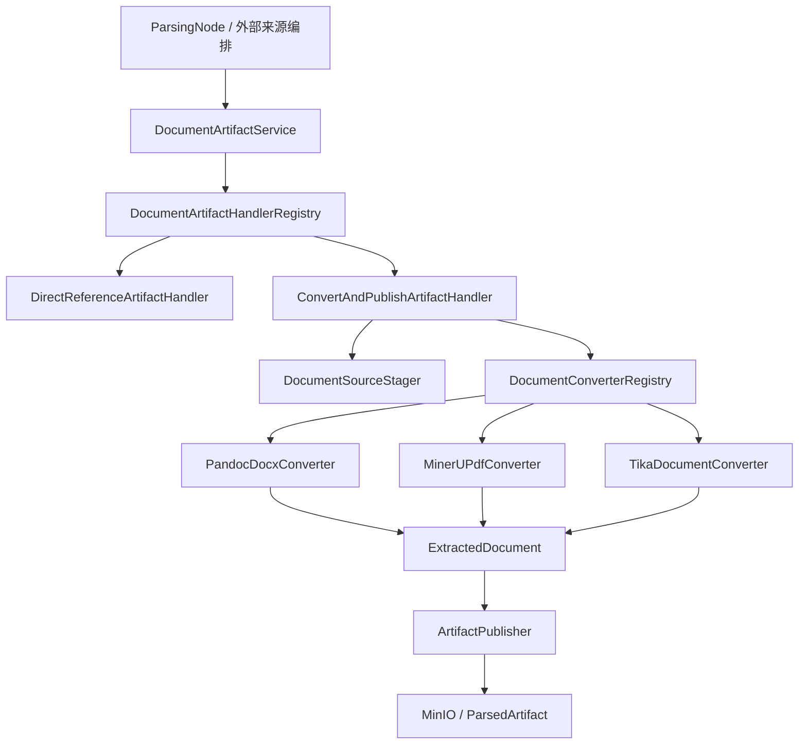

# 文件化文档解析制品管线设计

## 1. 背景与目标

当前文档解析链路虽已按 `DocumentArtifactParser` 路由，但多个环节仍将完整正文、ZIP 条目和图片加载为 `String` 或 `byte[]`。其中飞书 CLI 的 JSON 响应同时包含完整 Markdown，`readAllBytes()` 会使并发消息消费时的堆内存随文档大小线性放大。MinerU ZIP 提取与外部来源持久化也存在同类问题。

本设计将解析中间制品改为临时工作区中的文件，统一以流式方式上传对象存储。DOCX 由 Pandoc 转为 Markdown，PDF 保持由 MinerU 解析。飞书 Docx 通过官方导出任务下载 DOCX 后，复用同一 Pandoc 解析路径。

目标：

- DOCX 的 Markdown 转换保留 Word 的语义标题层级、列表、表格和图片，避免 MinerU 对标题层级的损失。
- 飞书、Pandoc、MinerU 的大文件正文和图片不再完整驻留 JVM 堆。
- Markdown 主文件、资源文件、来源快照均可追踪、可清理、失败可补偿。
- 保留工作流对 `ParsedArtifact` 的交接契约和现有 PDF OCR 行为；移除职责混杂的 `DocumentArtifactParser` SPI。

非目标：

- 不自动重跑历史 Word 文档；仅新导入和用户主动重新处理使用 Pandoc。
- 不从粗体、字体大小或视觉布局推测标题。Pandoc 只根据 DOCX 中真实的 Word Heading 样式输出 Markdown 标题。
- 不将飞书白板额外拆解或猜测嵌入位置；飞书导出的 DOCX 中实际保存的内容由 Pandoc 正常转换和提取。
- 不在本次将 PPT、文本、Excel 的现有解析实现全面迁移为文件化实现。

## 2. 术语与边界

| 名称 | 含义 | 所有者 | 非含义 |
| --- | --- | --- | --- |
| 原始文件 | 本地上传的源文件，或飞书导出的 DOCX 快照 | Document / source reader | 解析后的 Markdown |
| 解析工作区 | 单次解析任务独占的临时目录 | `ArtifactWorkspace` | 对象存储永久目录 |
| 提取制品 | 工作区内的主 Markdown 文件、资源文件和元数据 | `DocumentConverter` | 已上传的对象存储文件 |
| 发布制品 | 已保存到对象存储、可由后续切分读取的制品 | `ArtifactPublisher` | 内存中的正文 |
| 来源快照 | 可追溯的外部平台原始响应文件；飞书为导出的 DOCX | external source reader | CLI JSON 或重复下载的内容 |
| 解析资源 | Markdown 引用的图片等二进制文件 | `ArtifactPublisher` | 临时目录中任意无关文件 |

工作区只能在本次解析内使用，发布成功或失败后必须删除。`ParsedArtifact` 仍是工作流和持久化层之间的稳定交接对象，只包含对象键、内容类型和小型元数据，不承载正文。

## 3. 架构决策

### ADR-1：DOCX 使用 Pandoc，PDF 继续使用 MinerU

**背景**：飞书桌面端导出的 DOCX 可保留画板、高亮块等 Word 内容；Pandoc 可以依据 Word 样式输出 Markdown 标题，并通过 `--extract-media` 提取媒体。PDF 需要 OCR 和版面理解，Pandoc 不适合作为替代。

**备选方案**：

1. Word/PDF 继续统一走 MinerU。
2. 给飞书单独增加 Pandoc 分支，保留本地 Word 的 MinerU 路径。
3. 按格式路由：DOCX 使用 Pandoc，PDF 使用 MinerU。

**决策**：采用方案 3。

**后果**：新导入 DOCX 的标题语义与图片保真度提高；运行环境需要部署并配置 Pandoc。历史 Word 解析产物不发生自动变化。

### ADR-2：以门面、处理策略与格式 SPI 替代 `DocumentArtifactParser`

**背景**：现有 `DocumentArtifactParser` 的实现同时承担文件类型路由、对象存储读取、远程调用、格式转换、资源上传、Markdown 全文重写和元数据组装。接口名称为 Parser，实际却是端到端编排器，无法成为可扩展的格式 SPI。

**备选方案**：

1. 保留 `DocumentArtifactParser`，只为 DOCX 增加 Pandoc 实现。
2. 将接口改名为 `DocumentConverter`，但仍由每个实现自行上传制品。
3. 删除 `DocumentArtifactParser`，由应用门面编排 Handler、Converter Registry 和 Publisher。

**决策**：采用方案 3。`DocumentArtifactService` 是面向工作流和外部来源的唯一应用门面；`DocumentArtifactHandler` 决定透传或转换路径；`DocumentConverter` 是只负责格式转换的 SPI；`ArtifactPublisher` 是唯一对象存储发布者。

**后果**：Pandoc、MinerU 和 Tika 复用同一资源发布、流式 URL 重写、失败补偿与对象前缀规则。注册表启动时校验每个 `DocumentFormat` 最多只能有一个 Converter，避免依赖 Spring Bean 列表顺序。Markdown 和 Excel 不再伪装成 Parser，而由透传 Handler 返回原对象引用。

### ADR-3：所有大制品以文件而非字符串交接

**决策**：`SourceReadResultBO` 不再承载完整 `byte[]` 快照和 Markdown `String`。外部来源改为返回受管工作区内的文件化来源制品，或直接调用统一发布流程。Pandoc、MinerU ZIP 和 Markdown 重写均使用 `Path` 与有界缓冲流。

**后果**：对象大小不再直接放大 Java 堆；需要增加临时磁盘容量、工作区清理和上限配置。

### ADR-4：按文档专属前缀清理解析制品

**决策**：文档删除时，除原对象外清理 `parsed/{documentId}/` 与 `source-snapshots/{documentId}/` 两个精确前缀。清理消息升为新版本，同时兼容仅含原对象和主解析对象的旧版本消息。

**后果**：图片资源与来源快照不会泄漏。删除前缀必须校验为当前文档 ID 的规范化路径，禁止任意前缀或存储桶级删除。

## 4. 组件设计

### 4.1 类型模型与应用门面

- `DocumentFormat` 是 infra 内部的文件格式枚举，替代裸字符串 `ParserFileTypes`；工作流在边界将 document 模块的 `FileType` 映射为该枚举，避免 infra 依赖 document 模块。
- `DocumentArtifactRequest` 是不可变应用请求，包含 documentId、文件名、`DocumentFormat`、来源位置与 OCR 等转换选项。
- `DocumentArtifactService` 是唯一公开编排入口，返回已有的 `ParsedArtifact`。它不包含格式转换、临时文件或 MinIO 的实现细节。
- `DocumentArtifactHandler` 声明可处理的格式；`DocumentArtifactHandlerRegistry` 在启动阶段建立 `DocumentFormat -> Handler` 映射并拒绝重复注册。
- `DirectReferenceArtifactHandler` 支持 Markdown、Excel，直接返回原对象引用。它明确表达透传语义，不再作为 Parser 实现。
- `ConvertAndPublishArtifactHandler` 支持需要转换的格式；它依次阶段化输入、选择 Converter、发布制品，并在失败时触发补偿。

### 4.2 工作区与阶段化

- `ArtifactWorkspace` 为一次解析创建唯一临时根目录；目录名仅由服务端生成，提供受限路径解析，拒绝绝对路径、`..`、符号链接和工作区外的文件。
- `ArtifactWorkspaceFactory` 统一创建工作区；工作区实现 `AutoCloseable`，在完成、异常和超时路径执行递归删除，删除前验证真实路径仍位于配置的临时根目录内。
- `DocumentSourceStager` 使用 `BoundedFileTransfer` 将对象存储或已下载来源文件安全阶段化为工作区文件。工作区总大小由写入计数器限制，不能只依赖 HTTP 头或 ZIP 条目声明大小。

### 4.3 `DocumentConverter` SPI 与 Registry

`DocumentConverter` 是文件级格式转换 SPI：声明其支持的 `Set<DocumentFormat>`，接收已阶段化的本地文件和转换上下文，返回 `ExtractedDocument`。`ExtractedDocument` 只包含主 Markdown `Path`、相对于资源根目录的安全资源文件清单和小型元数据；不得返回 Markdown 全文、图片字节或 ZIP 条目字节。

`DocumentConverterRegistry` 在 Spring 容器启动时将每个格式映射到唯一 Converter；缺少 Converter 或重复 Converter 均在启动期失败，而非在运行时依赖 `List` 注入顺序。

- `PandocDocxConverter` 仅支持 `WORD`。它以工作区为命令工作目录执行 `pandoc source.docx --from=docx --to=markdown --wrap=none --extract-media=assets --output=content.md`。`PandocProcessRunner` 负责安全启动进程、限制 stderr、超时终止并验证输出。实测没有 Heading 样式的 DOCX 不会输出 `#`，这是源文档缺少语义信息，不做启发式补偿。
- `MinerUPdfConverter` 仅支持 `PDF`，保留 OCR、限流和远程调用配置。它调用 `MinerUZipArtifactExtractor` 将 ZIP 逐条目、逐文件有界解压至工作区，拒绝路径穿越、重复冲突、链接和不允许的文件。
- `TikaDocumentConverter` 支持 PPT、纯文本，输出文件化文本制品。该迁移使其也进入统一发布链路，但不改变既有 Tika 文本抽取语义。

### 4.4 `ArtifactPublisher`

发布顺序：

1. 将每个资源文件以 `Files.newInputStream` 和 `Files.size` 上传到 `parsed/{documentId}/assets/`；对象名由 `ObjectNameResolver` 生成，文件扩展名白名单化。
2. 记录相对路径到对象访问地址的映射，映射仅保存资源数量级的小字符串。
3. 使用流式 Markdown 图片地址重写器，将提取出的主 Markdown 文件转换为第二个工作区文件；不调用 `Files.readString`，不创建全文 `String`。至少处理 Pandoc 输出的 ``，并保持无法匹配的链接原样。
4. 流式上传重写后的 Markdown 到 `parsed/{documentId}/content.md`。
5. 仅当全部上传成功后返回 `ParsedArtifact`。

若任一步失败，发布器删除本次已上传的 `parsed/{documentId}/` 前缀，避免残留半成品。已存在的同文档旧制品只在新制品完整发布成功后替换，确保重处理期间不存在空解析结果。

### 4.5 外部来源：飞书

- 新增飞书导出客户端，使用官方导出任务接口创建 DOCX 导出、轮询任务完成并下载结果。
- Wiki URL 先解析为真实 Docx 文档；标题和版本等轻量元数据通过官方元数据接口读取，不从 Markdown 正文推导。
- 下载响应直接有界复制到 `ArtifactWorkspace` 内的 `source.docx`；`Content-Length` 大于限制时快速失败，缺失或伪造时仍由实际字节计数保护。
- 同一文件先流式保存为 `source-snapshots/{documentId}/source.docx`，再直接交给 `DocumentArtifactService` 的 Word 路由，不重新从 MinIO 下载。
- 不使用 CLI 的 `docs +fetch` JSON Markdown 输出作为主路径，也不在导出失败时降级到会累积全文 Block 列表的旧读取路径。

语雀等其他来源在本次保持现有功能；其 `SourceReadResultBO` 迁移必须采用受限的文件化适配器，禁止以“兼容”为由继续让飞书路径回退到整文内存模型。

## 5. 存储、清理与兼容性

对象路径：

| 用途 | 路径 |
| --- | --- |
| 本地上传原文件 | `original/{yyyy/MM/dd}/{uuid}.{ext}` |
| 飞书 DOCX 来源快照 | `source-snapshots/{documentId}/source.docx` |
| 解析主文件 | `parsed/{documentId}/content.md` |
| 解析资源 | `parsed/{documentId}/assets/{uuid}.{ext}` |

`FileStorageService` / `FileStorageStrategy` 新增按前缀删除能力。MinIO 实现列举并逐个删除对象；调用方只能传入由 `ObjectNameResolver` 生成且与消息 `documentId` 匹配的两个前缀。

`DocumentStorageCleanupMessage` 新版本增加解析与来源制品前缀。消费者：

- 旧版本消息：保留现有“删除原对象、删除主解析对象”的行为；
- 新版本消息：删除原对象，并删除精确的解析和来源快照前缀；
- 所有删除操作保持幂等，单个对象失败交由现有 RocketMQ 重试机制处理。

## 6. 资源限制与错误处理

新增 `nexa.parser.artifact` 级别的公共限制和 `nexa.cloud-document.feishu.export`、`nexa.parser.pandoc` 的专属配置：

- 临时根目录、单工作区总大小、最大并发解析数；
- 飞书导出任务轮询间隔、总超时、DOCX 最大下载大小；
- Pandoc 可执行文件、执行超时、最大 Markdown 大小、最大资源数量、单资源大小和资源总大小；
- MinerU ZIP 条目数量、解压总大小、Markdown 和资源限制。

所有上限触发时：停止当前 HTTP 复制或外部进程、清理工作区、删除已发布前缀，并抛出带 documentId 的 `DocumentPipelineNonRetryableException`。网络中断、飞书临时故障、MinIO 暂时失败和 MinerU 服务错误保持可重试语义。日志记录 documentId、来源、解析器、字节数、条目数、耗时和失败类别，不记录正文、二进制内容、导出 URL 查询参数或凭据。

## 7. 验收与测试

1. DOCX 单测：使用带真实 Heading 1/2 和图片的 fixture，验证 Pandoc 生成 `#` / `##`、提取资源并重写图片 URL；无 Heading 样式的 fixture 不产生伪造标题。
2. Pandoc 进程测试：验证超时、退出码、缺失主文件、超限 Markdown 与超限资源均失败且清理工作区。
3. MinerU ZIP 测试：验证大条目按文件化方式处理、Zip Slip 和大小/数量超限被拒绝。
4. 发布器测试：验证资源与主文件由流上传、Markdown 以文件方式改写、发布中断会清理专属前缀。
5. 飞书导出客户端测试：覆盖创建任务、轮询成功、权限拒绝、轮询超时、下载超限及临时网络故障。
6. 清理消息测试：覆盖新版本前缀清理和旧版本消息兼容。
7. 集成验收：以 `D:\下载\飞书\架构演进.docx` 手工验证图片被提取；该样本当前没有 Word Heading 样式，因此预期不输出 Markdown 标题。

## 8. 发布策略

- 先部署 Pandoc 二进制与配置，并以小规模新 DOCX 导入验证。
- 新代码上线后，所有新本地 Word 和飞书 Docx 导入走 Pandoc；PDF 继续走 MinerU。
- 不批量迁移历史 Word 文档。需要更高保真的历史文档由用户显式发起重新处理。
- 观察 Pandoc 超时、临时目录占用、资源超限、前缀清理失败和消息重试指标；出现问题可关闭 Pandoc 路由，Word 恢复既有 MinerU 路径，不影响 PDF。
